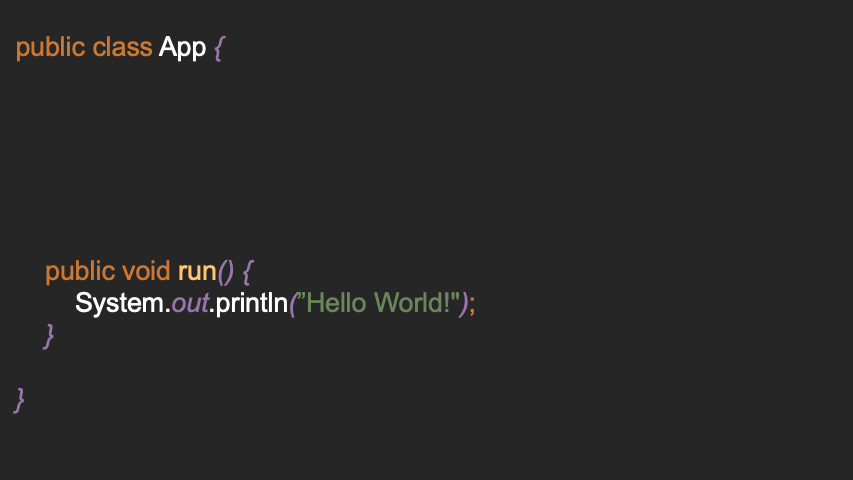

# EEEE

EEEE* is a tiny framework for simple console input of values, which I wrote mainly for exercises of
the university, because here often simple inputs with a scanner are needed, and I did not want to
rewrite them again and again.

Also, I didn't use any existing frameworks, because apparently we are only allowed to use
self-written code in the exams, and so I am allowed to use this mini-framework in the exams.

**NOTE:** This framework is ab-so-lutely not suitable for production use. 
It should only serve for practice.

**See EEEE in Action:**



## Entrypoint

The framework makes it very easy to define multiple "entry points"
(annotated with `@Entrypoint`) without always having to write different main methods:

```java
public class Application {

    @Entrypoint("Hello")
    public void sayHello() {
        System.out.println("Hello!");
    }

    @Entrypoint("World")
    public void sayWorld() {
        System.out.println("World!");
    }

}
```

If you now start the program, in via the `Starter.start` method, you will be asked which program you
want to run:

```java
public static void main(String[]args)throws Exception{
    Starter.start(Application.class,args);
    }
```

Console Output:

```
1. Application::Hello@sayHello ()
2. Application::World@sayWorld ()
[?] Select Method to run [1-2]: 1
[Runner] Requesting parameters () ...

[Runner] Invoking sayHello@Application w/ ()...
---
Hello!
---
Execution complete! Took approx. 0ms.
```

### Parse Arguments

A method can have any number of arguments. If the type is a standard type
(defined in the package: `io.d2a.eeee.wrapper.wrappers`) the user is asked for an input and tries to
parse the input:

```java
@Entrypoint("Echo")
public void echo(final String input){
    System.out.println("Echo! "+input);
    }
```

Console Output:

```
[string] [] arg0 []: test
---
Echo! test
---
```

#### Customize Prompt

Since the parameter name is unknown at runtime, you'll be prompted with `arg0`, `arg0`, ...

These names can be changed with the `@Prompt` annotation:

```java
@Entrypoint("Echo")
public void echo(@Prompt("Echo!") final String input){
    System.out.println("Echo! "+input);
    }
```

Console-Output:

```
[string] [] Echo! []: hi!
---
Echo! hi!
---
```

#### Defaults

Default values can be specified using the `@Default` annotation.

```java
@Entrypoint("Echo")
public void echo(
@Default("Hello :)")
@Prompt("Echo!") final String input
    ){
    System.out.println("Echo! "+input);
    }
```

Console-Output:

```
[string] [] Echo! [Hello :)]: 
---
Echo! Hello :)
---
```

#### Validation

A simple validation (e.g. minimum or maximum values for numbers, as well as the length of strings)
can be specified using the `@Min`, `@Max` annotation:

```java
@Entrypoint("Echo")
public void echo(
@Prompt("Age") @Min(0) @Max(100) final int age
    ){
    System.out.println("You're "+age+" years old!");
    }
```

Console-Output:

```
[int] [0-100] Age []: -100
[int] [0-100] Age []: 101
[int] [0-100] Age []: 19

[Runner] Invoking echo@Application w/ (i)...
---
You're 19 years old!
---
```

#### Other (more or less) useful Annotations

##### Trim

Trim can be used on strings to remove spaces from entered strings. By default this function is on,
but can be turned off by passing false:

```java
@Entrypoint("Name")
public void echo(@Prompt("Name") @Trim(false) String str){
    System.out.printf("Hello, %s!%n",str);
    }
```

### Custom Wrappers

If you want to use your own types as parameters, 
these types must implement the `Wrapper<T>` interface:

```java
import io.d2a.eeee.annotations.AnnotationProvider;
import io.d2a.eeee.generate.Factory;
import io.d2a.eeee.wrapper.Wrapper;
import java.util.Scanner;

public class Rectangle implements Wrapper<Rectangle> {

    /**
     * @param scanner contains a Scanner which can be used to ask for input in the console
     * @param prompt contains the value of @Prompt() or the parameter name if empty
     * @param provider can be used to request annotations of a parameter, e. g. @Max
     * @return
     */
    @Override
    public Rectangle wrap(Scanner scanner, String prompt, AnnotationProvider provider) {
        // See below for information about the Factory helper class
        return Factory.createClass(scanner, Rectangle.class);
    }

}
```

Now the rectangle can be used as a parameter in an Entry method:

```java
@Entrypoint
public void run(@Prompt("Rect") Rectangle rect){
    System.out.println(rect);
}
```
Console-Output:
```java
[Runner] Requesting parameters (R) ...

[int] [0-] Height [12]: 
[int] [0-] Width []: 41

[Runner] Invoking echo@Application w/ (R)...
---
Rectangle{height=12, width=41}
---
Execution complete! Took approx. 4ms.
```

- See **example** for a full example.
- See **wrappers** for some predefined wrappers


---

## Injection

The framework includes a Mini-Injector functionality.
Injected values can be used in entrypoint classes by default:

```java
import io.d2a.eeee.annotations.Entrypoint;
import io.d2a.eeee.inject.Inject;

public class App {

    @Inject
    private Scanner scanner; // scanner which asks for user input
    
    @Inject("args")
    private String[] args; // program args

    @Entrypoint
    public void hello() {
        final String line = this.scanner.nextLine();
        System.out.println(line);
    }

}
```

Default injectable values:
- Type `Scanner`, Name: None (`@Inject Scanner scanner`)
- Type: `String[]`, Name: `args` (`@Inject("args") String[] args`)

### Custom Injection

```java
import io.d2a.eeee.inject.Inject;

public class App {

    @Inject("name")
    private String name;
    
    @Inject
    private int age;

    public static void main(String[] args) {
        final Injector injector = new Injector()
            .register(String.class, "Thorsten", "name")
            .register(int.class, 22);
        
        final App app = new App();
        injector.inject(app);
        app.print();
    }
    
    public void print() {
        System.out.printf("%s is %d.%n", this.name, this.age);
    }

}
```

---

## Factory

Using the Factory class, you can create POJO classes that require input, for example.

The "classic" way would be:

```java
public class Rectangle {

    private int height;
    private int width;

    public Rectangle(int height, int width) {
        this.height = height;
        this.width = width;
    }
}

public class App {

    @Entrypoint("Create Rectangle")
    public void echo(
        @Prompt("Height") int height,
        @Prompt("Width") int width
    ) {
        Rectangle rect = new Rectangle(height, width);
        System.out.println(rect);
    }

}
```

With the help of the Factory class you can now simplify the creation of the class:

```java
import io.d2a.eeee.inject.Inject;

public class Rectangle {

    @Prompt("Height")
    private int height;
    @Prompt("Width")
    private int width;
}

public class App {

    @Inject
    private Scanner scanner;

    @Entrypoint("Create Rectangle")
    public void echo() {
        Rectangle rect = Factory.createClass(this.scanner, Rectangle.class);
        System.out.println(rect);
    }

}
```

**NOTE:** The Factory class currently only accesses the default constructor (without arguments). The
values are ***injected only after the object is initialized**.*


## Installation

### Maven

1. Add this repository to your `pom.xml`:

```xml
<repositories>
    <repository>
        <id>jitpack.io</id>
        <url>https://jitpack.io</url>
    </repository>
</repositories>
```

2. Add the `eeee`-dependency:

```xml
<dependency>
    <groupId>com.github.darmiel</groupId>
    <artifactId>eeee</artifactId>
    <version>1.0</version>
</dependency>
```

---

*) To be honest, I've already forgotten the meaning of the abbreviation. But it was certainly
perfect!
